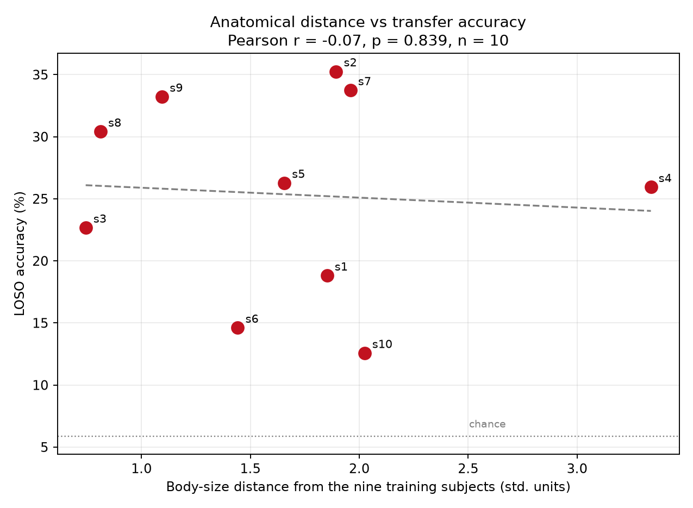

# semg-cross-subject

**The generalisation study.** How much does cross-subject accuracy improve per additional training subject — and where does it stop improving?

Follow-on to [semg-edge-ai](https://github.com/Nivedita-Saha/semg-edge-ai) (the compression study). Ninapro DB5, 10 subjects, 17 gestures, 1D-CNN.

## Where this project starts

The first project compressed a 1D-CNN 4.4x with negligible accuracy loss — then found the model did not transfer to a new person. Three explanations for that failure were proposed and tested. All three were refuted:

| Hypothesis | Test | Result |
|---|---|---|
| Armband rotation (make the model ignore it) | Electrode-shift augmentation, 3 seeds | **Refuted** — -14.1 pp within-subject, -11.0 pp cross-subject |
| Amplitude / scaling differences | Three normalisation strategies | **Refuted** — 7% of the gap; rest-based calibration actively harmful (-13.8 pp) |
| Armband rotation (correct it) | Oracle over all 8 possible shifts | **Refuted** — the best rotation is no rotation; the ceiling is zero |

The conclusion those force: the cross-subject gap is **not geometric and not a scaling artefact**. What remains, by elimination, is anatomical — different forearms producing genuinely different spatial signatures for the same intended gesture, not rotated versions, not rescaled versions, different ones.

So multi-subject training cannot teach a universal gesture pattern; there isn't one. At best it teaches a *distribution over anatomies*. That is interpolation, not generalisation — and it should saturate.

**This project measures where.**

## Baselines to beat

| | Accuracy |
|---|---|
| Within-subject (train s1, test s1) | 74.13% |
| Cross-subject (train s1, test s2) | 27.62% |
| Chance (17 classes) | 5.88% |

For external reference, the published DB5 baseline is 69.04% — double-Myo setup, mDWT feature, SVM, 41 movements (Pizzolato *et al.*, 2017). That is a within-subject figure and is not comparable to any cross-subject number below.

## Headline result


**More subjects do not fix cross-subject transfer.** Cross-subject accuracy climbs from 17.6% (N=1) to 24.6% (N=4), then stops. N=6 and N=8 are indistinguishable from N=4. A saturating fit puts the asymptote at approximately **25%** (95% CI 20.4–29.7%) — below any deployable threshold. Even the upper bound of that interval lies less than half way to 60%, so the conclusion does not depend on the point estimate: there is no number of training subjects at which the data-only approach reaches a deployable accuracy here.

Within-subject accuracy meanwhile *falls* (71.9% -> 60.3%) as subjects are added. The gap narrows because the top line descends, not because the bottom line rises.

| N subjects | Cross-subject | Within-subject |
|---|---|---|
| 1 | 17.59 +/- 2.11 | 71.92 +/- 3.00 |
| 2 | 18.12 +/- 2.64 | 67.15 +/- 1.89 |
| 4 | 24.62 +/- 1.54 | 66.03 +/- 1.69 |
| 6 | 24.42 +/- 1.69 | 61.74 +/- 1.31 |
| 8 | 23.94 +/- 1.50 | 60.30 +/- 1.38 |

3 subject draws x 3 runs per point, except at N=8 where only one draw exists (the full pool of 8). Error bars at N=1-6 therefore combine subject-draw and run-to-run variance; at N=8 the error bar reflects run-to-run variance alone. Subjects 9 and 10 held out permanently.

## The obvious objection, ruled out

*"Your CNN was simply too small to hold eight forearms."* Tested: widen the network at fixed N=8.

| Width | Params | Within-subject | Cross-subject |
|---|---|---|---|
| 1x | 18,545 | 61.01 +/- 0.79 | 23.48 +/- 1.57 |
| 2x | 65,745 | 65.69 +/- 0.32 | 23.94 +/- 0.55 |
| 4x | 246,161 | 66.71 +/- 1.72 | 22.24 +/- 0.74 |

13x the parameters recovers within-subject accuracy (+5.7 pp) and leaves cross-subject accuracy unchanged. **The plateau is not a capacity artefact.** The extra capacity is spent memorising training anatomies; none of it transfers.

## Who you transfer to matters more than how many you train on

Leave-one-subject-out across all ten subjects: mean **25.35%**, ranging from 12.6% (s10) to 35.3% (s2) — a 22.7 pp spread, against roughly 1 pp of run-to-run noise. Between-person variance is 7.4x run-to-run variance.

Body size does not explain it. Correlating LOSO accuracy against distance from the nine training subjects in (height, weight, forearm circumference) space gives r = -0.07, p = 0.84, n=10. Tested individually: BMI r = -0.05, height r = +0.09, weight r = +0.04, forearm circumference r = +0.41 (p = 0.24). None significant.



Full analysis, limitations, and how these numbers sit against the literature: [`findings.md`](findings.md).

## Status

Phases 0-5 complete, including LOSO across all ten subjects. Few-shot calibration in progress.

---

## Running

```
python3 -m venv venv && source venv/bin/activate
pip install -r requirements.txt
```

Data is not included. Register at [ninapro.hevs.ch](https://ninapro.hevs.ch) to download DB5 and place the subject files in `data/raw/`.

```
python src/check_subjects.py      # Phase 1   — verify all 10 subjects
python src/build_cache.py         # Phase 2   — window and cache (35,305 windows)
python src/check_split.py         # Phase 2   — leakage check on the split

python src/reproduce_seeds.py     # Milestone 1 — VALIDATION GATE (see below)

python src/scaling.py             # Phase 3   — scaling curve, N = 1,2,4,6,8
python src/plot_scaling.py        # Phase 4   — the headline figure

python src/capacity_control.py    # Phase 3.5 — width sweep at fixed N=8
python src/loso.py                # Phase 5   — leave-one-subject-out, all 10
python src/demographics.py        # Phase 5.3 — body-size correlation
```

**The validation gate.** Before any new experiment is run, the pipeline must
reproduce the `semg-edge-ai` result it inherits: train on s1, test on s2,
expecting ~74.13% within-subject and ~27.62% cross-subject. `reproduce_seeds.py`
runs this across three seeds, because a single run cannot distinguish a sound
pipeline from a broken one that got lucky. If the expected values do not sit
within roughly two standard deviations of the means, there is a bug and the
experiments below are not worth running. (`reproduce.py` is the single-seed
version, kept for reference.)

`preprocess.py`, `windowing.py`, `model.py`, and `data_pipeline.py` are shared
modules imported by the scripts above, not run directly.

Subjects 9 and 10 are held out permanently from the scaling experiments and
appear only in the LOSO analysis.

## Method notes

- **Split by repetition, following the published Ninapro protocol.** Train on repetitions 1, 3, 4 and 6; validate on 2; test within-subject on 5. This is the split used by the dataset authors (Pizzolato *et al.*, 2017), and it matters: the six repetitions of each gesture are near-identical, so a random split places near-duplicates in both train and test.
- **200 ms windows with 100 ms overlap**, also matching the published protocol.
- **Normalisation statistics computed from the training subjects only.** `check_split.py` verifies that those statistics do not change when the test subject changes.
- **Subjects 9 and 10 are locked.** They are never trained on and never tuned on in the scaling experiments.

## Dataset

Pizzolato, S., Tagliapietra, L., Cognolato, M., Reggiani, M., Müller, H. and Atzori, M. (2017) 'Comparison of six electromyography acquisition setups on hand movement classification tasks', *PLoS ONE*, 12(10), e0186132.
