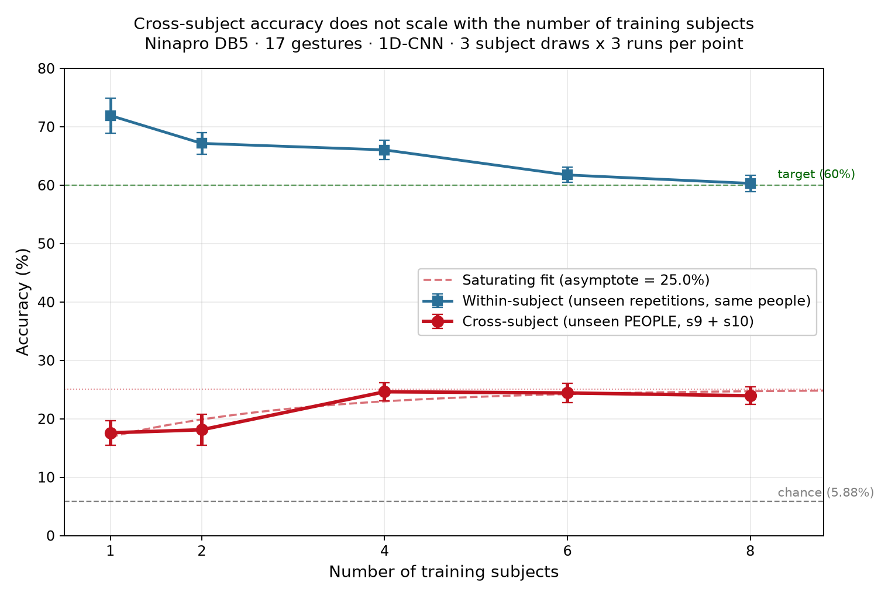

# Findings — The Cross-Subject Scaling Study

**Ninapro DB5 · 17 gestures · 1D-CNN · follow-on to [semg-edge-ai](https://github.com/Nivedita-Saha/semg-edge-ai)**

## The question

The first project found that a compressed 1D-CNN did not transfer from one person to another, and refuted three explanations for why (armband rotation, twice; amplitude scaling). That left one explanation standing: the cross-subject gap is anatomical, not geometric. But "the last explanation standing" is not evidence for it.

This study asks a question with a shape rather than a yes/no: **how much does cross-subject accuracy improve per additional training subject, and where does it stop?**

## Headline finding

**Training on more subjects does not solve cross-subject transfer. It saturates at four subjects, at roughly a quarter of the accuracy a deployable system needs — and the plateau is not caused by the model being too small.**

## The five results

| # | Hypothesis / question | Test | Result |
|---|---|---|---|
| 1 | More training subjects will steadily improve cross-subject transfer | Scaling curve, N = 1,2,4,6,8, up to 3 draws x 3 runs, held-out subjects 9+10 | **Refuted** — rises 17.6% -> 24.6% by N=4, then flat (N=6: 24.4%, N=8: 23.9%). Saturating fit asymptote ≈ 25% (95% CI 20.4-29.7%) |
| 2 | The plateau is an artefact of the model being too small to hold many anatomies | Widen the CNN 13x (18.5k -> 246k params) at fixed N=8 | **Refuted** — within-subject recovers +5.7 pp, cross-subject unchanged (23.5% -> 22.2%). Extra capacity is spent memorising training anatomies |
| 3 | Cross-subject accuracy is roughly the same for everyone | Leave-one-subject-out across all 10 subjects, 3 runs each | **Refuted** — mean 25.35%, but ranges 12.6% (s10) to 35.3% (s2), a 22.7 pp spread. Between-person variance is 7.4x run-to-run variance |
| 4 | The subjects the model fails on are those most unlike the training set in body size | Correlate LOSO accuracy with distance from the 9 training subjects in (height, weight, forearm circumference) space | **Refuted** — r = -0.07, p = 0.84, n=10. No relationship, and no visible trend |
| 5 | The scaling-curve plateau is an artefact of the specific s9+s10 test set | Compare the 2-subject held-out result against the 10-subject LOSO mean | **Not supported** — LOSO mean (25.35%) matches the scaling asymptote to within 0.4 pp. s9 and s10 are among the ten, so the figures are not independent, but they sit at opposite ends of the LOSO range (33.2% and 12.6%), so the pair was neither an unusually easy nor an unusually hard test set |

## What the results force

The gap is not a data-quantity problem: eight subjects do no better than four. It is not a model-capacity problem: 13x the parameters does not move it. It is a **person** problem — which individual you transfer *to* matters far more than how many people you trained on (a 22.7 pp swing across held-out subjects, against ~1 pp of run-to-run noise).

But it is not explained by gross body size. Height, weight, and forearm circumference — the anatomical measurements DB5 provides — predict nothing (result 4). So the difficulty is anatomical in a *finer* sense than body size: muscle architecture, fat distribution, the precise placement of electrodes on an individual forearm, motor-unit recruitment habits. None of these is captured by the three numbers in the dataset. This sharpens the first project's conclusion rather than confirming it: "anatomy" cannot mean simply "body size."

## The scaling curve

| N subjects | Cross-subject | Within-subject |
|---|---|---|
| 1 | 17.59 +/- 2.11 | 71.92 +/- 3.00 |
| 2 | 18.12 +/- 2.64 | 67.15 +/- 1.89 |
| 4 | 24.62 +/- 1.54 | 66.03 +/- 1.69 |
| 6 | 24.42 +/- 1.69 | 61.74 +/- 1.31 |
| 8 | 23.94 +/- 1.50 | 60.30 +/- 1.38 |

Error bars at N=1-6 combine subject-draw and run-to-run variance; at N=8 only one draw exists (the full pool), so its error bar reflects run-to-run variance alone.

Within-subject accuracy *falls* as subjects are added. The gap between the curves narrows (54 -> 36 pp) almost entirely because the upper curve descends, not because the lower one rises. Reporting this as "the gap closes" would be misleading.

## Extrapolation

The saturating fit `acc = 25.0 - B·exp(-k·N)` places the asymptote at 25.0% — below any deployable threshold. Asking "how many subjects to reach 60%?" therefore has **no finite answer** on this architecture and dataset: the fitted ceiling lies below the target. Data scale is not the route to a deployable cross-subject model here.

## How these numbers sit against the literature

Published DB5 accuracies of 87–93% are **within-subject or cross-session** figures — the model is tested on the same people it trained on, in a different session or repetition. They are not comparable to a cross-subject number, and the within-subject column above (60–72%) is the fair comparison for them (lower here because this is a deliberately small edge model, and only exercise E2's 17 gestures).

The comparable quantity — leave-one-subject-out — is far lower across the literature. Preliminary LOSO experiments on Ninapro DB1 have been reported at around 30% (Wei et al., cited in EMGBench, 2024), attributed to the difficulty of precise per-individual electrode placement. This study's 25.35% LOSO mean on DB5 sits in the same regime, and points to the same cause. The gap between the ~90% within-subject numbers that dominate the literature and the ~25–30% cross-subject reality is the central unsolved problem in the field, not a shortcoming of this particular model.

## Limitations, stated plainly

- **The extrapolation rests on five points and a two-parameter fit.** "No finite N" is a claim about this architecture on this dataset, not a law.
- **The test set is small.** LOSO uses all ten subjects, but ten is still a small population, and DB5's own documentation notes signal-quality and labelling issues across the Ninapro sub-datasets.
- **The anatomy conclusion is by elimination, not by direct measurement.** Result 4 rules out body size; it does not measure the finer anatomical factors it points to. Confirming those would need per-subject electrode-level or imaging data that DB5 does not contain.
- **n=10 makes result 4 underpowered.** A weak body-size effect could be hidden. The claim is "no detectable relationship and no visible trend," not "proven absence."

## What this sets up

The practical answer the first project pointed to — a small amount of labelled data from the new user (few-shot calibration) — is now the obvious next experiment, because the data-only route is closed. If scale cannot cross the person gap, per-user calibration is the only remaining mechanism with a clear rationale.
